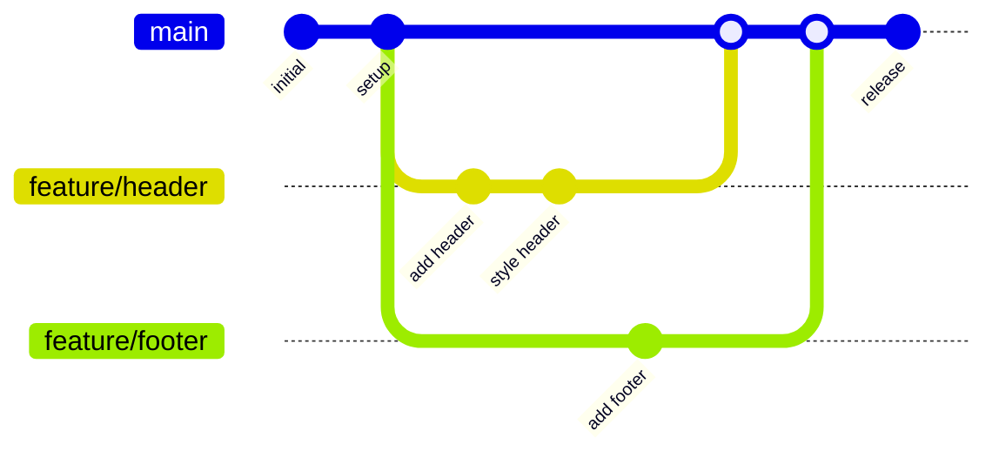
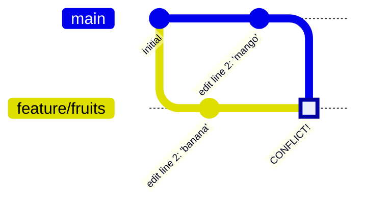
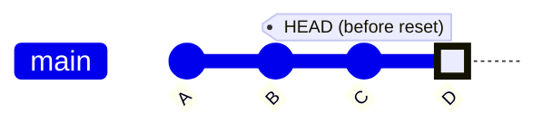
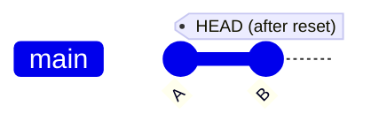

# Git Collaboration Workshop

> **Duration:** 3.5 hours  
> **Prerequisites:** Basic Git knowledge (repos, commits, branches, remotes, PRs)  
> **Format:** Presentation + hands-on pair exercises

---

## Table of Contents

1. [Quick Recap](#-quick-recap) ⏱️ 5 min
2. [Why Branches?](#-why-branches) ⏱️ 10 min
3. [The 3 Types of Branches](#-the-3-types-of-branches) ⏱️ 15 min
4. [Push, Pull & Fetch](#-push-pull--fetch) ⏱️ 10 min
5. [Merge Conflicts](#-merge-conflicts) ⏱️ 20 min
6. [Git Diff & Stash](#-git-diff--stash) ⏱️ 15 min
7. [Undoing Changes](#-undoing-changes) ⏱️ 30 min
8. [Checkout to Specific Commit](#-checkout-to-specific-commit) ⏱️ 10 min
9. [Useful Commands](#-useful-commands) ⏱️ 10 min
10. [Good Commit Messages](#-good-commit-messages) ⏱️ 10 min
11. [Creating Good PRs](#-creating-good-prs) ⏱️ 10 min

---

## 🔄 Quick Recap

Before we dive into advanced collaboration, let's refresh the basics:

| Concept          | One-liner                                                                  |
| ---------------- | -------------------------------------------------------------------------- |
| **Repository**   | A folder tracked by Git containing your project's files and history        |
| **Commit**       | A snapshot of your changes with a message describing what changed          |
| **Branch**       | An independent line of development, like a parallel universe for your code |
| **Remote**       | A copy of your repository hosted elsewhere (e.g., GitHub)                  |
| **Pull Request** | A request to merge your branch into another, enabling code review          |

---

## 🌿 Why Branches?

Branches let you work on features, fixes, or experiments **without affecting the main codebase**.

### The Feature Branch Workflow

```
main         ●───●───●───────────●───●
                  \             /
feature/login      ●───●───●───●
```

**Benefits:**

- ✅ `main` always stays stable and deployable
- ✅ Multiple features can be developed in parallel
- ✅ Easy to discard experiments that don't work out
- ✅ Clear history of what was changed and why



---

## 🌳 The 3 Types of Branches

This is where it gets interesting! On your local machine, you have **three** types of branches:

```
┌─────────────────────────────────────────────────────────────────┐
│                        YOUR COMPUTER                            │
├─────────────────────────────────────────────────────────────────┤
│                                                                 │
│   ┌─────────────────────┐    ┌─────────────────────────────┐   │
│   │  LOCAL BRANCHES     │    │  REMOTE-TRACKING BRANCHES   │   │
│   │  (your work)        │    │  (cache of remote state)    │   │
│   │                     │    │                             │   │
│   │  • main             │    │  • origin/main              │   │
│   │  • feature/login    │    │  • origin/feature/login     │   │
│   │                     │    │                             │   │
│   │  Non-tracking or    │    │  Updated by: git fetch      │   │
│   │  Tracking           │    │                             │   │
│   └─────────────────────┘    └─────────────────────────────┘   │
│                                           ▲                     │
└───────────────────────────────────────────│─────────────────────┘
                                            │
                                            │ fetch/pull/push
                                            ▼
┌─────────────────────────────────────────────────────────────────┐
│                          GITHUB                                 │
│                                                                 │
│   Remote Branches: main, feature/login, feature/signup          │
│                                                                 │
└─────────────────────────────────────────────────────────────────┘
```

### 1. Local Non-Tracking Branches

Not connected to any remote branch. Created with:

```bash
git branch my-experiment
```

### 2. Local Tracking Branches

Connected to a remote branch. Know where to push/pull.

```bash
# Check which branches are tracking
git branch -vv
```

Output example:

```
* main        b31f87c [origin/main] "my sample commit"
  new-feature b760e04 "my branch is strong"   # ← not tracking anything
```

To make a branch track a remote:

```bash
git branch -u origin/my-branch
```

### 3. Remote-Tracking Branches

Your local **cache** of what's on the remote. You can't work on these directly.

```bash
# See all branches including remote-tracking
git branch -a
```

Output:

```
* main
  feature/login
  remotes/origin/main
  remotes/origin/feature/login
```

---

## 📤 Push, Pull & Fetch

### The Command Flow

```
┌──────────────┐                    ┌──────────────┐
│    LOCAL     │                    │    GITHUB    │
│  REPOSITORY  │                    │   (remote)   │
└──────┬───────┘                    └──────┬───────┘
       │                                   │
       │──── git push origin main ────────▶│  Send your commits
       │                                   │
       │◀─── git fetch origin main ────────│  Get info (don't merge)
       │                                   │
       │◀─── git pull origin main ─────────│  Get info AND merge
       │                                   │
```

### Commands Explained

| Command                     | What it does                                |
| --------------------------- | ------------------------------------------- |
| `git push origin <branch>`  | Send your local commits to GitHub           |
| `git fetch origin <branch>` | Download remote changes but **don't** merge |
| `git pull origin <branch>`  | Download **and** merge (= fetch + merge)    |

### Pro Tip: Fetch First

```bash
# See what changed before pulling
git fetch origin main
git diff origin/main

# Now you know what's coming
git merge origin/main
```

---

## ⚔️ Merge Conflicts

Conflicts happen when Git can't automatically merge changes because **the same lines were modified**.

### When Do Conflicts Occur?



### What a Conflict Looks Like

```
Here are some fruits:
apple
<<<<<<< HEAD
banana
=======
mango
>>>>>>> main
orange
```

- `<<<<<<< HEAD` — Your current branch's version
- `=======` — Separator
- `>>>>>>> main` — The incoming branch's version

### Resolving in VS Code

1. VS Code highlights conflicts with colors
2. Click one of the quick actions:
   - **Accept Current Change** (keep yours)
   - **Accept Incoming Change** (keep theirs)
   - **Accept Both Changes** (keep both)
   - Or manually edit to combine
3. Save the file
4. Stage and commit:

```bash
git add <conflicted-file>
git commit -m "Resolve merge conflict in <file>"
```

> 📝 **Exercise 1 in EXERCISES.md** — Practice creating and resolving conflicts in pairs!

---

## 🔍 Git Diff & Stash

### Git Diff — See What Changed

```bash
# Changes in working directory (not staged yet)
git diff

# Changes that are staged (after git add)
git diff --staged

# Summary of which files changed
git diff --stat

# Compare with another branch
git diff feature/login

# Compare two specific commits
git diff abc123 def456
```

### Reading Diff Output

```diff
diff --git a/fruits.txt b/fruits.txt
index 1234567..abcdefg 100644
--- a/fruits.txt
+++ b/fruits.txt
@@ -1,4 +1,5 @@
 apple
-banana
+mango
+kiwi
 orange
 grape
```

- Lines starting with `-` (red) = removed
- Lines starting with `+` (green) = added
- Context lines have no prefix

### Git Stash — Save Work for Later

Sometimes you need to switch branches but aren't ready to commit:

```
┌─────────────────┐         ┌──────────────────┐
│  Working Dir    │         │                  │
│  (dirty state)  │ ──────▶ │     STASH        │
│                 │ stash   │   (safe storage) │
│  Can't switch   │         │                  │
│  branches!      │         │  Can switch now! │
└─────────────────┘         └──────────────────┘
```

### Stash Commands

```bash
# Save current changes to stash
git stash

# See list of stashes
git stash list
# Output: stash@{0}: WIP on main: abc123 my commit message

# Bring back changes AND remove from stash
git stash pop stash@{0}

# Bring back changes but KEEP in stash
git stash apply stash@{0}
```

> 📝 **Exercise 2 in EXERCISES.md** — Practice stashing when switching branches!

---

## ⏪ Undoing Changes

This is the most powerful section — knowing how to undo mistakes safely!

### Overview: Which Command to Use?

```
┌─────────────────────────────────────────────────────────────────────┐
│                     UNDOING CHANGES DECISION TREE                   │
├─────────────────────────────────────────────────────────────────────┤
│                                                                     │
│   Want to undo UNCOMMITTED changes?                                 │
│   └── git restore <file>           (discard working dir changes)   │
│   └── git restore --staged <file>  (unstage, keep changes)         │
│                                                                     │
│   Want to undo your LAST commit?                                    │
│   └── git reset --soft HEAD~1      (undo commit, keep changes)     │
│   └── git reset --hard HEAD~1      (undo commit, DELETE changes)   │
│                                                                     │
│   Want to undo OLD commit (keep history)?                           │
│   └── git revert <commit>          (creates new "undo" commit)     │
│                                                                     │
│   Want to COPY a commit from another branch?                        │
│   └── git cherry-pick <commit>     (copy specific commit here)     │
│                                                                     │
│   Want to REWRITE history (squash, reorder, edit)?                  │
│   └── git rebase -i HEAD~N         (interactive rebase)            │
│                                                                     │
└─────────────────────────────────────────────────────────────────────┘
```

### Git Reset — Remove Commits



**After `git reset --soft HEAD~2`:**



| Type      | Command                   | Changes go where? | Use when                     |
| --------- | ------------------------- | ----------------- | ---------------------------- |
| **Soft**  | `git reset --soft HEAD~1` | Staging area      | Want to recommit differently |
| **Mixed** | `git reset HEAD~1`        | Working directory | Want to re-add files         |
| **Hard**  | `git reset --hard HEAD~1` | **DELETED** ⚠️    | Want to completely undo      |

### Git Revert — Safe Undo for Shared History

Creates a **new commit** that undoes a previous commit. Safe for shared branches!

```bash
git revert abc123
```

```
Before revert:        After revert:
A ─── B ─── C         A ─── B ─── C ─── C'
      │                     │           │
  (bad commit)          (bad commit)  (undoes C)
```

### Git Cherry-Pick — Copy a Commit

Copy a specific commit from one branch to another:

```bash
# On the branch where you want the commit
git cherry-pick abc123
```

```
feature:   A ─── B ─── C
                       │ cherry-pick
main:      X ─── Y ────┴─── C'
```

### Git Rebase -i — Rewrite History

The most powerful (and dangerous) tool:

```bash
git rebase -i HEAD~3
```

Opens editor:

```
pick abc123 Add feature
pick def456 Fix typo
pick ghi789 Update docs

# Commands:
# p, pick   = use commit
# r, reword = use commit, but edit message
# e, edit   = use commit, but stop for amending
# s, squash = use commit, but meld into previous
# f, fixup  = like squash, but discard message
# d, drop   = remove commit
```

**Common uses:**

- `squash` — Combine multiple commits into one
- `reword` — Fix a commit message
- `drop` — Remove a commit from history

> ⚠️ **Warning:** Rebase of commits that have been pushed to a shared branch will require a forced push!

> 📝 **Exercises 3, 4, 5 in EXERCISES.md** — Practice reset, revert, cherry-pick, and rebase!

---

## 🕐 Checkout to Specific Commit

Want to see what your code looked like in the past?

```bash
# Find the commit hash
git log --oneline

# Go back in time
git checkout abc123
```

### ⚠️ Detached HEAD State

```
Normal:                     Detached HEAD:

main ─── A ─── B ─── C      main ─── A ─── B ─── C
                     │                     │
                   HEAD                  HEAD

You're on the branch        You're on a specific commit
Can commit normally         DON'T commit here!
```

**In detached HEAD:**

- 👀 Look around, run tests, explore
- ❌ Don't make commits (they'll be lost!)
- 🔙 Return to safety: `git checkout main`

---

## 🛠️ Useful Commands

<details>
<summary><strong>Click to expand command reference</strong></summary>

### Discard & Unstage

```bash
# Discard changes in working directory (git 2.23+)
git restore <file>

# Unstage a file (keep changes)
git restore --staged <file>

# Old syntax (still works)
git checkout -- <file>
git reset HEAD <file>
```

### Amend Last Commit

```bash
# Change the last commit message
git commit --amend -m "New message"

# Add forgotten files to last commit
git add forgotten-file.txt
git commit --amend --no-edit
```

### Remove File from Git (Keep Locally)

```bash
# Stop tracking a file but don't delete it
git rm --cached <file>
```

### Check Branch Sync Status

```bash
# See if local branch is up to date with remote
git log --oneline origin/main..main    # commits you have that remote doesn't
git log --oneline main..origin/main    # commits remote has that you don't
```

</details>

---

## 📝 Good Commit Messages

### The Format

```
<type>: <short summary> (max 50 chars)

<optional body - explain WHY, not WHAT>

<optional footer - issue refs, breaking changes>
```

### Common Types

| Type       | Purpose                              |
| ---------- | ------------------------------------ |
| `feat`     | New feature                          |
| `fix`      | Bug fix                              |
| `docs`     | Documentation only                   |
| `style`    | Formatting (no code change)          |
| `refactor` | Code restructure (no feature change) |
| `test`     | Adding tests                         |
| `chore`    | Maintenance tasks                    |

### Examples

```bash
# ✅ Good
git commit -m "feat: add user login functionality"
git commit -m "fix: prevent crash when email is empty"
git commit -m "docs: update API documentation"

# ❌ Bad
git commit -m "fix"
git commit -m "WIP"
git commit -m "asdfasdf"
git commit -m "changes"
```

---

## 🎯 Creating Good PRs

### What Makes a Good Pull Request?

```
┌─────────────────────────────────────────────────────────────────┐
│                    GOOD PR CHECKLIST                            │
├─────────────────────────────────────────────────────────────────┤
│                                                                 │
│  ✅ Small and focused (one feature/fix per PR)                  │
│  ✅ Clear, descriptive title                                    │
│  ✅ Description explains WHAT and WHY                           │
│  ✅ Links to related issue (Fixes #123)                         │
│  ✅ Screenshots for UI changes                                  │
│  ✅ Tests pass                                                  │
│  ✅ Code is reviewed before merging                             │
│                                                                 │
└─────────────────────────────────────────────────────────────────┘
```

### PR Description Template

```markdown
## What does this PR do?

Adds login functionality with email/password authentication.

## Why is this change needed?

Users need to be able to create accounts and access protected features.

## How to test

1. Go to /login
2. Enter email and password
3. Click "Sign In"
4. Should redirect to dashboard

## Screenshots

(if applicable)

## Related Issues

Fixes #42
```

### PR Size Guidelines

| Lines Changed | Rating          | Review Time |
| ------------- | --------------- | ----------- |
| < 100         | 🟢 Perfect      | 15 min      |
| 100-300       | 🟡 Good         | 30 min      |
| 300-500       | 🟠 Large        | 1 hour      |
| > 500         | 🔴 Split it up! | ???         |

---

## 📚 Quick Reference Card

<details>
<summary><strong>Click to expand full cheatsheet</strong></summary>

### Branches

```bash
git branch <name>           # Create branch
git checkout <name>         # Switch to branch
git checkout -b <name>      # Create and switch
git branch -d <name>        # Delete branch
git branch -vv              # Show tracking info
git branch -a               # Show all branches
```

### Remote Operations

```bash
git remote -v                        # List remotes
git push origin <branch>             # Push to remote
git pull origin <branch>             # Pull from remote
git fetch origin <branch>            # Fetch without merge
git push -u origin <branch>          # Push and set upstream
```

### Viewing History

```bash
git log --oneline           # Compact log
git log --graph --oneline   # Visual branch graph
git diff                    # Show changes
git diff --staged           # Show staged changes
```

### Undoing Things

```bash
git restore <file>                   # Discard changes
git restore --staged <file>          # Unstage
git reset --soft HEAD~1              # Undo commit, keep staged
git reset --hard HEAD~1              # Undo commit, delete changes
git revert <commit>                  # Create undo commit
git cherry-pick <commit>             # Copy commit here
git rebase -i HEAD~N                 # Interactive rebase
```

### Stashing

```bash
git stash                   # Stash changes
git stash list              # List stashes
git stash pop stash@{0}     # Apply and remove
git stash apply stash@{0}   # Apply and keep
```

</details>

---

## ➡️ Next Steps

1. Complete the exercises in [EXERCISES.md](EXERCISES.md)
2. Practice these commands on personal projects
3. Review the [additional resources](#-additional-resources)

---

## 📖 Additional Resources

- [Git Documentation](https://git-scm.com/doc)
- [Atlassian Git Tutorials](https://www.atlassian.com/git/tutorials)
- [Learn Git Branching (Interactive)](https://learngitbranching.js.org/)
- [Oh Shit, Git!?!](https://ohshitgit.com/) — Quick fixes for common mistakes
